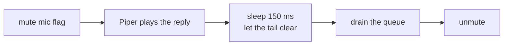
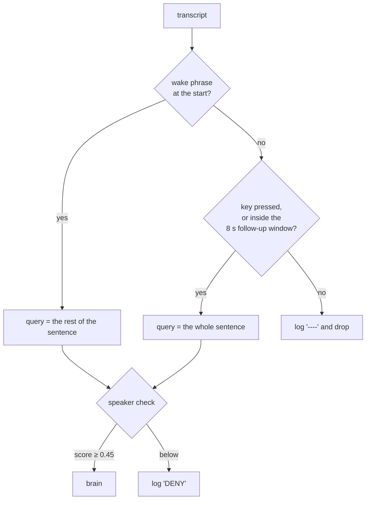
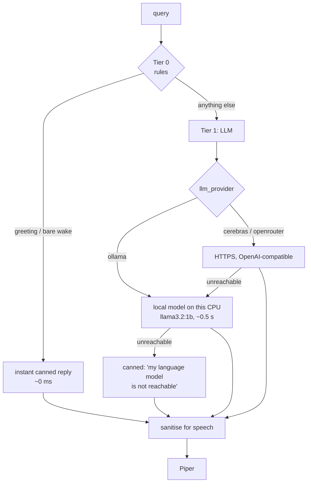
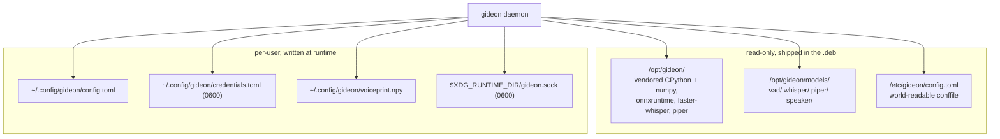
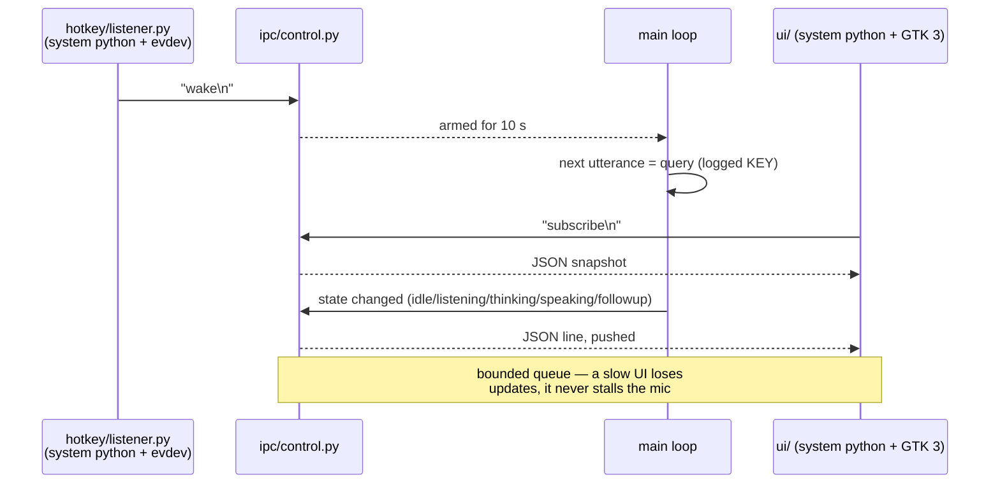
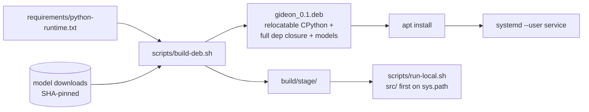

# Gideon — Architecture

An always-on, offline voice assistant for Ubuntu. You say *"Hey Gideon, what's the
capital of Japan"*; a microphone, four small neural models and a Python loop turn
that into spoken words back. Everything runs on your CPU; nothing leaves the
machine unless you deliberately pick a cloud brain.

This is the only design document. `NEW-SYSTEM-SETUP.md` is how to install it,
`DEPENDENCIES.md` is what it needs.

---

## 1. The whole thing in one picture

```mermaid
flowchart LR
    Mic([🎤 Microphone]) --> CAP[capture.py<br/>16 kHz frames]
    CAP --> VAD[vad.py<br/>is this speech?]
    VAD --> SEG[segments&#40;&#41;<br/>cut whole sentences]
    SEG --> STT[stt.py<br/>speech → text]
    STT --> WAKE{wake.py<br/>said my name?}
    WAKE -- no --> DROP[ignore]
    WAKE -- yes --> SPK{speaker.py<br/>is it the owner?}
    SPK -- no --> DENY[deny]
    SPK -- yes --> BRAIN[brain.py<br/>what do I answer?]
    BRAIN --> TTS[tts.py<br/>text → speech]
    TTS --> Spk([🔊 Speakers])

    KEY([⌨️ push-to-talk key]) --> SOCK[control.py<br/>unix socket]
    SOCK -.arms.-> WAKE
    BUS[state.py<br/>StatusBus] -.streams.-> UI([🖥️ tray + HUD])
    SOCK --- BUS
```



Read it as a conveyor belt: audio only ever moves left to right, one utterance at
a time, in a **single thread**. The two boxes at the bottom are the only things
attached to the side of the belt — a keyboard key that can wake it, and a status
feed that shows what it is doing.

---

## 2. The vocabulary

| Term | Plain meaning | Where |
|---|---|---|
| **VAD** | Voice Activity Detection — a tiny model that answers "is someone talking right now?" 31 times a second | `speech/vad.py` (Silero v4, ONNX) |
| **Endpointing** | Deciding when a sentence *ended*, so you can transcribe a whole thought instead of syllables | `__main__.segments()` |
| **STT / ASR** | Speech-to-text | `speech/stt.py` (faster-whisper, `tiny.en`) |
| **Wake phrase** | The name that means "this one's for you" | `nlu/wake.py` |
| **Speaker verification** | Comparing a *voiceprint*, so only you are answered | `speech/speaker.py` (ECAPA-TDNN) |
| **Embedding** | A voice squeezed into 192 numbers; two recordings of one person land near each other | `speech/speaker.py` |
| **Router / brain** | Chooses cheap canned answers vs. asking a language model | `nlu/brain.py` |
| **LLM** | The language model that writes the actual answer | `llm/` (Ollama, or a cloud API) |
| **TTS** | Text-to-speech | `speech/tts.py` (Piper) |
| **ONNX Runtime** | The engine that runs VAD, speaker and Piper models on CPU without PyTorch | vendored |
| **Frame** | 512 audio samples = 32 ms of sound | everywhere |
| **Daemon** | The always-running background process (`systemd` user service) | `__main__.py` |
| **IPC** | Inter-process communication — here, one unix socket file | `ipc/control.py` |

---

## 3. How it listens

```mermaid
sequenceDiagram
    participant Mic as PortAudio callback thread
    participant Q as bounded queue (64)
    participant Loop as main loop
    participant V as Silero VAD

    Mic->>Q: 512-sample float32 frame (every 32 ms)
    Note over Q: queue full → drop the frame<br/>(never block the audio driver)
    Loop->>Q: get()
    Loop->>V: speech probability for this frame
    alt 3 frames in a row above 0.5
        Note over Loop: segment OPEN (plus 300 ms of pre-roll)
    end
    alt 700 ms of silence, or 15 s max
        Note over Loop: segment CLOSED → yield one utterance
    end
```

Three details carry the whole design:

- **The callback thread only enqueues.** Audio drivers punish slow callbacks with
  glitches, so the capture callback copies a frame into a bounded queue and
  returns. If the queue is full it throws the frame away rather than stall.
- **Pre-roll.** VAD needs ~96 ms of speech before it is confident, by which time
  the first syllable is gone. So the last 300 ms of audio is always kept in a
  ring buffer and prepended — that is why "Hey" is not clipped.
- **Silence is the sentence delimiter.** 700 ms of quiet closes the segment. That
  is the whole "endpointing" algorithm; there is no phrase model.

### Self-hearing guard

Gideon would otherwise wake himself up on his own voice. Before speaking:



Any new code path that speaks **must** repeat this sequence.

---

## 4. How it decides the words are for him

There is **no wake-word model**. Whisper transcribes *every* segment, and
`wake.match()` fuzzy-compares the head of the transcript against a list of
phrases (`difflib` ratio ≥ 0.80).

That sounds wasteful and is deliberate: it needs no extra model, and it lets the
config absorb the fact that **Whisper renders "Gideon" as "get in"** at every
model size. `wake_phrases` therefore contains `hey get in`, `hey giddy on`,
`hike it in` and friends. Those variants are load-bearing — trimming them to the
ones that *look* correct breaks wake detection, and a bigger Whisper does not fix it.



- **Follow-up window** — for 8 s after a reply you can just keep talking, no name
  needed. Saying *stop / never mind / thanks* closes it and clears LLM history.
- **Log tags** tell you exactly what happened: `WAKE`, `FOLLOW`, `KEY`, `DENY`,
  `----` (heard, not for me).

### Who is speaking

Wake matching says **what** was said; it cannot say **who**. So the utterance is
embedded with an ECAPA-TDNN speaker model and cosine-compared against the
voiceprint written by `gideon --enroll` (stored at
`~/.config/gideon/voiceprint.npy`).

Two rules matter more than the model does:

- **It fails open.** No voiceprint, no model, or a load error ⇒ everyone is
  answered and the health row says why. A failed download must never silently
  mute the assistant.
- **The feature extractor is a hand-port of Kaldi's `fbank`.** Get it subtly
  wrong and the embeddings become meaningless *while still returning confident
  numbers*. That is why `--selftest` asserts same-voice-vs-noise separation
  instead of merely loading the model.

Gated: wake matches and push-to-talk. Not gated by default: the follow-up window
(it can only be open because a verified turn just happened). Clips under 0.4 s
are accepted unscored — a deliberate, measured hole.

---

## 5. How it answers — the tiered brain



- **Tier 0 exists for latency.** Most of what people say to an assistant is a
  pattern, not a reasoning problem; a greeting should not pay model time.
- **Tier 1 is optional.** A missing or unreachable Ollama probes once, logs once,
  and degrades. It must never crash or hang the daemon.
- **Tier 2** (Claude Code headless, for real actions) is an unwired branch in
  `brain.py`. v0.1 executes no commands and touches no files on your behalf.
- **One factory, `llm/build()`,** picks local vs cloud, so `__main__.py` never
  branches on the provider and `brain.py` never learns there is a choice.
- **Cloud adds no Python dependency** — plain `urllib`, not an SDK — because
  every dependency has to be vendored into the `.deb`.
- **Replies are sanitised before they are spoken.** Cloud models answer in
  markdown tables; the speakers get plain prose or nothing.

Two traps that are invisible from the code:

| Trap | Why |
|---|---|
| `llm/cloud.USER_AGENT` | Cloudflare answers urllib's default UA with `403 / 1010`, which looks exactly like a bad API key |
| `gideon.service` sets `IPAddressDeny=any` | Gideon was offline-first; choosing a cloud provider installs a systemd drop-in that reopens outbound access |
| Non-reasoning models only | `qwen3` / `deepseek-r1` burn 15–22 s/reply thinking on a laptop CPU |

---

## 6. How it touches the filesystem

Gideon reads a lot and writes almost nothing.



**Config resolution** — `Config.load()` reads the **first existing** of
`$GIDEON_CONFIG` → `~/.config/gideon/config.toml` → `/etc/gideon/config.toml`.
That first file wins **entirely**; there is no merging. So `gideon --provider`
seeds the user file from the system one before editing it, and rewrites its own
marked block wholesale — otherwise writing one user setting would silently revert
every `/etc` setting to its default. (`CONFIG_PATHS` is built at *import* time,
so `$GIDEON_CONFIG` cannot be changed inside a running process.)

**Keys never go in `config.toml`,** because it is world-readable. API keys live in
`credentials.toml`, created 0600 via `os.open` — write-then-chmod would leave the
key briefly readable by everyone. Env vars override the file.

**Model paths** derive from `GIDEON_HOME` / `GIDEON_MODELS`, set by the launcher.

---

## 7. The socket: keyboard and screen

The daemon owns the microphone, so a key press must **not** start a second
Gideon. One unix socket, two jobs:



- **`state.py` is a bulletin board**, not a message bus: current pipeline state
  plus one health row per subsystem (mic, vad, stt, tts, llm, speaker, control).
  Every row in the health panel is a fact the daemon published, never a constant.
- **Publish a window's deadline *before* the state that depends on it**, or the
  ticker expires it instantly.
- **`Control.start()` pings before unlinking** an existing socket, so a second
  instance can never steal it from the daemon holding the microphone.

### Why `hotkey/` and `ui/` are strange

`evdev`, GTK and PyGObject are **apt packages**, not vendored into the `.deb`. So
those modules are *executed by* `/usr/bin/python3` and import nothing from
`gideon` — they re-implement the socket path and the state names instead. GTK **3**,
not 4, because the AppIndicator library links GTK 3 and the two cannot share a
process. The HUD re-execs onto XWayland: Mutter has no layer-shell, so a
Wayland-native window cannot be placed or kept on top.

---

## 8. How a machine ends up with all this



- The `.deb` is **self-contained**: installation needs only apt, first run needs
  no network.
- The launcher runs Python with `-E -s`, and injects `sys.path` explicitly, so a
  stray `PYTHONPATH` or `~/.local` package can never shadow the vendored
  numpy/onnxruntime.
- `run-local.sh` reuses the staged runtime and models but puts `src/` first, so
  edits apply on the next run with **no rebuild**. Rebuild only when dependencies
  or models change.
- Runs as a **user** unit, not system-wide. It needs `ReadWritePaths=%t` to bind
  the socket under `ProtectSystem=strict`.

---

## 9. How you check it works

There is no test suite. The checks are:

| Command | Asserts |
|---|---|
| `gideon --selftest` | every model loads; wake matching; Tier 0 router; TTS synthesis; speaker same-voice-vs-noise separation; provider wiring; control socket + status feed; that a second daemon neither steals nor deletes a live socket |
| `gideon --ui --self-check` | which turns the HUD shows (key press and wake yes, ambient speech no) and which bubbles each leaves |
| `gideon --ui --health` | one-shot text health report; exits 1 if the daemon is offline |
| `gideon --ui --demo` | replays a conversation through the HUD — for the animations no check can assert |
| `journalctl --user -u gideon -f` | the live `WAKE` / `FOLLOW` / `KEY` / `DENY` / `----` tags |

New invariants go into `--selftest`. The UI has its own because GTK cannot be
imported from the vendored runtime.

---

## 10. Where the code lives

```
src/gideon/
├── __main__.py     the single-threaded pipeline; segments(); the main loop
├── core/           config.py  state.py (StatusBus)  credentials.py
├── audio/          capture.py — PortAudio callback → bounded queue
├── speech/         vad.py  stt.py  tts.py  speaker.py
├── nlu/            wake.py (transcript matching)  brain.py (tier router)
├── llm/            __init__.py (factory)  client.py (Ollama)  cloud.py
│                   provider.py (the table of cloud providers)  fallback.py
├── ipc/            control.py — the unix socket: arming + status feed
├── cli/            setup.py  ui.py  enroll.py  provider.py — the wizards
├── hotkey/         evdev listener      ← run by /usr/bin/python3
└── ui/             GTK 3 tray, HUD, health panel  ← run by /usr/bin/python3

scripts/     what a developer runs        packaging/  what a user installs
requirements/  declared dependencies      docs/  this, setup, dependencies
```

Roughly 5,000 lines of Python, no framework, no threads beyond the audio callback
and the socket server.
